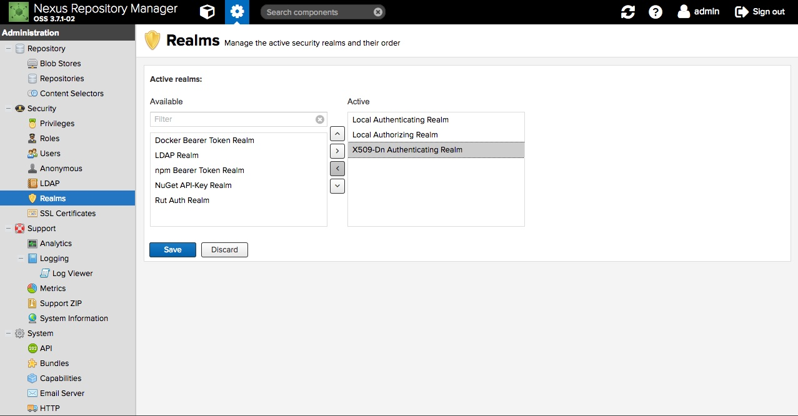

# Nexus3 x509 DN Plugin
This plugin adds the ability for building a configuraiton file that defines which users have which roles based on their DN when using x509 two-way SSL authentication.

## Nexus Compatibility

Should work with Nexus version **3.2.1** and newer (only tested with version **3.7.1**)

## Setup

#### 2. Group / Roles Mapping
A yaml file is used to make the roles to DNs:

```
nx-admin:
    - CN=Firstname Lastname, OU=Unknown, O=Unknown, L=Annapolis Junction, ST=MD, C=US
nx-deploy:
    - CN=Firstname Lastname, OU=Unknown, O=Unknown, L=Annapolis Junction, ST=MD, C=US
    - CN=Firstname Lastname2, OU=Unknown, O=Unknown, L=Annapolis Junction, ST=MD, C=US
```


## Installation

#### 0. Prerequisites

##### Directory naming convention:
For the following commands we assume your nexus installation resides in `/opt/sonatype/nexus`. See [https://books.sonatype.com/nexus-book/reference3/install.html#directories](https://books.sonatype.com/nexus-book/reference3/install.html#directories) for reference.

#### 1. Download and install

The following lines will:
- create a directory in the `nexus` / `kafka` maven repository
- download the latest release from github
- unzip the releae to the maven repository
- add the plugin to the `karaf` `startup.properties`.


```shell
mkdir -p /opt/sonatype/nexus/system/com/github/vincentrussell/ &&\
wget -O /opt/sonatype/nexus/system/com/github/vincentrussell/nexus3-x509-dn-security-plugin.zip https://github.com/vincentrussell/nexus3-x509-dn-security-plugin/releases/download/1.1/nexus3-x509-dn-security-plugin.zip &&\
unzip /opt/sonatype/nexus/system/com/github/vincentrussell/nexus3-x509-dn-security-plugin.zip -d /opt/sonatype/nexus/system/com/github/vincentrussell/ &&\
echo "reference\:file\:com/github/vincentrussell/nexus3-x509-dn-security-plugin/1.1/nexus3-x509-dn-security-plugin-1.1.jar = 200" >> /opt/sonatype/nexus/etc/karaf/startup.properties
```

#### 2. Create configuration mapping file
Create `/opt/sonatype/nexus/etc/x509-dn-security-config.yaml`

Set the system property (X509DnAuthenticatingRealm.config.file) to point to that file:

The easiest way is to modify (/opt/sonatype/nexus/bin/nexus.vmoptions) and add:

`-DX509DnAuthenticatingRealm.config.file=/opt/sonatype/nexus/etc/x509-dn-security-config.yaml`

#### 3. Restart Nexus
Restart your Nexus instance to let it pick up your changes.

#### 4. Add the realm in the settings
Log in to your nexus and go to _Administration > Security > Realms_. Move the X509-Dn Authenticating Realm to the right. The realm order in the form determines the order of the realms in your authentication flow. We recommend putting X509-Dn Authenticating Realm _after_ the built-in realms.


## Development
You can build the project with the integrated maven wrapper like so: `./mvnw clean package`

You can also build locally using Docker by running: 

```
docker build -t vincentrussell/nexus3-x509-oath-plugin .
docker run -p 8443:8443 -p 5005:5005 -it --rm vincentrussell/nexus3-x509-oath-plugin
```

You can build a ready to run docker image using the [`Dockerfile`](Dockerfile) to quickly spin up a nexus with the plugin already preinstalled.

## Credits

The whole project is heavily influenced by the [nexus3-github-oauth-plugin](https://github.com/larscheid-schmitzhermes/nexus3-github-oauth-plugin).


# Change Log

## [1.1](https://github.com/vincentrussell/nexus3-x509-dn-security-plugin/tree/nexus3-x509-dn-security-plugin-1.1) (2018-04-02)


- expire cached auths after five mintues so that the server doesn't have to be restarted to respect changes to the config file


## [1.0](https://github.com/vincentrussell/nexus3-x509-dn-security-plugin/tree/nexus3-x509-dn-security-plugin-1.0) (2018-02-19)

**Initial Release:**

- Initial Capability


